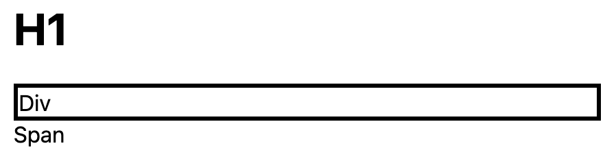

# HTML atributo selektorius

* Elementai taip pat gali būti atrinkti pagal jų atributų reikšmes.

```html
[name=abc] {
    ...
}
```

---

```html
<!DOCTYPE html>
<html>

<head>
  <style>
    [data-test=test] {
      border: medium solid;
    }
  </style>
</head>

<body>
  <h1>H1</h1>
  <div data-test="test">Div</div>
  <span>Span</span>
</body>

</html>
```

---

