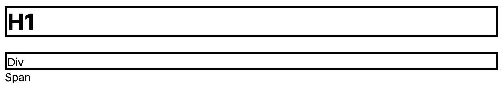

# Kombinuotas (combinated) elementų slelektorius

* Simbolis `,` leidžia pasirinkti ir pritaikyti stiliaus atribūtus keletai elementų vienų metų.

```html
selector1, selector2 {
    ...
}
```

---

```html
<!DOCTYPE html>
<html>

<head>
  <style>
    h1, div {
      border: medium solid;
    }
  </style>
</head>

<body>
  <h1>H1</h1>
  <div>Div</div>
  <span>Span</span>
</body>

</html>
```

---

