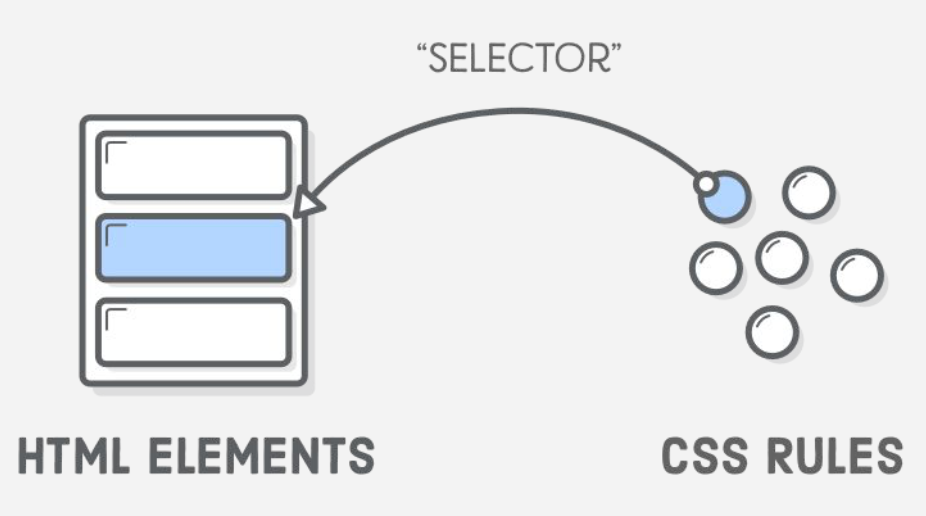

# CSS selektoriai

Paprastai sakant CSS selektoriai yra skirti mūsų HTML elementus susieti su CSS atributais, kurie nusako kaip mūsų susieti elementai turi atrodyti.

---

---

* Elementus galima atrinkti trimis būdais:
  * pagal žymos pavadinimą (h1, p, body ...),
  * pagal class atributą (prieš selektorių rašome .),
  * pagal ID atributą (prieš selektorių rašome #).
* Stiliai, susieti su atributu id, turi aukščiausią prioritetą, po to pagal priotitetą eina klasės (class) atributas ir žymos pavadinimas turi mažiausią prioritetą. Apie stiliaus pritaikimo prioritetus ir kodėl tai svarbu, aptarsime vėliau.

---

Žėmiau yra pateiktas HTML kodas.  Atsakykite į klausimus:
* Kokią spalvą turi heading tekstas?
* Kokia spalvą turi paragrafas?

---

```html
<html>
<head>
    <style>
        h1 {
            color: blue;
        }

        .center {
            text-align: center;
            color: red;
        }
    
        #first {
            color: green;
        }
    </style>
</head>
<body>
    <h1 class="center" id="first">Heading!</h1>
    <p class="center">Paragraph.</p>
</body>
</html>
```
