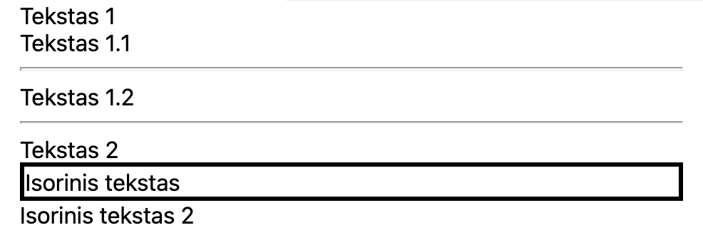

# Sekančio (next) elemento slelektorius

* `+` simbolis leidžia pritaikyti stilių pagal elementą, esantį iškart po pirminio elemento.

```html
<!DOCTYPE html>
<html>

<head>
  <style>
    .my-element + div {
      border: medium solid;
    }
  </style>
</head>

<body>
  <div class="my-element">
    <div>
      Tekstas 1
      <div>Tekstas 1.1</div>
      <hr />
      <div>Tekstas 1.2</div>
    </div>
    <hr />
    <div>Tekstas 2</div>
  </div>
  <div>Isorinis tekstas</div>
  <div>Isorinis tekstas 2</div>
</body>

</html>
```

---


