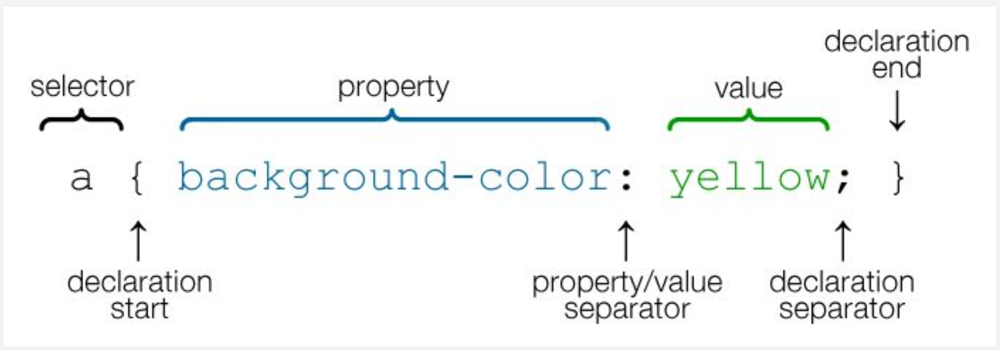

# Sintaksė

* CSS yra naudojamas paprastas šablonas - jūs apibrėžiate elementą, kuriam turi būti pritaikyta stilistika, kitas žingsnis yra pridėti prie jo kai kuriuos stiliaus atributus/savybes:

```html
h1 {
    color: red;
    text-align: center;
}
```

---



---

```html
h1 { width: 200px; }
div { display: none; }
a { color: red; font-size: 30px; }

.myRuleset {
    display: block; 
    background-color: red; 
    position: relative;
}

<div class="myRuleset"></div>
<div style="color: red; font-size: 30px;">
```
