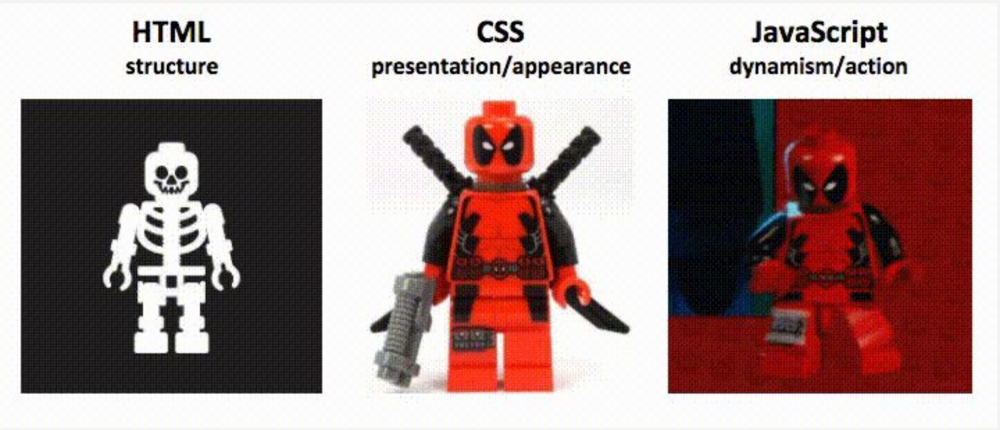

# Kas tai yra CSS?

* CSS reiškia *Cascading Style Sheet* (lt. kaskadinius stiliaus lapus).
* Tai kalba, naudojama HTML dokumento stiliams apibrėžti.
* Tai reiškia, kad kiekviena atskira HTML žyma (ang. tag) gali būti rodoma savaip pritaikant tam tikrą stilistiką. Mes galime pakeisti spalvą, dydį, derinimą, paraštes ir visą kitą.

